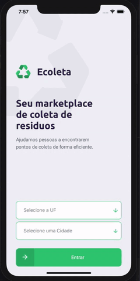

# Ecoleta

## Description
This application helps people find points of the collection in your location.

The settings used typescript with knex, React Native(Expo), express, and DB sqlite3.

## structure folder

| folder      | description                                                   |
|-------------|---------------------------------------------------------------|
| server      | This is Server of application                                 |
| web      | This is the version to the browser where can create news points of collection                    |
| mobile      | This is the version to the mobile where people find points of the collection in your location |                    |

## Screenshot
**WEB**

**MOBILE**

